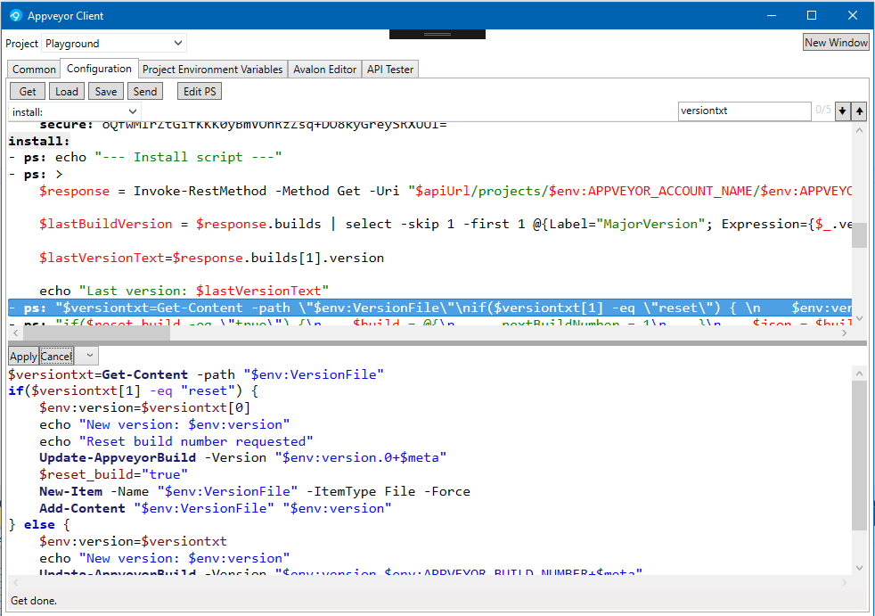

# AppVeyor Client

A windows client for [AppVeyor](https://www.appveyor.com/).

[Homepage](https://ksware.github.io/KsWare.AppVeyorClient/) •
[Wiki](https://github.com/KsWare/KsWare.AppVeyorClient/wiki) •
[Web-Installer](http://www.ksware.de/software/AppVeyorClient/setup.exe) •
[Application](http://www.ksware.de/software/AppVeyorClient/KsWare.AppVeyorClient.application)

## Version: 0.2 Beta

## Used Technologies

- Visual Studio 2019
- .NET 4.7.2, C# 7.2, WPF
- NuGet: [AvalonEdit](https://github.com/icsharpcode/AvalonEdit), [KsWare Presentation Framework](https://github.com/KsWare/KsWare.Presentation), [Common.Logging](https://github.com/net-commons/common-logging), [AutoMapper](https://github.com/AutoMapper/AutoMapper), Nunit 3.x, [Newtonsoft.Json](https://github.com/JamesNK/Newtonsoft.Json), System.Windows.Interactivity.WPF

